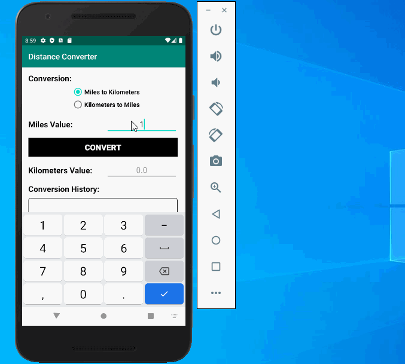

# DistanceConverter
Distance Converter Android Application

# App Features:
* The app allows the user to select either Miles-to-Kilometers or Kilometers-to-Miles conversions. Conversion is selected using Radio Buttons. Miles-to-Kilometers is the default if there is no saved preference.
* Used the following formulae for conversion:
** Miles to Kilometers: Mi * 1.60934 Example: 25mi * 1.60934 = 40.2 km
** Kilometers to Miles: Km * 0.621371 Example: 60km * 0.621371 = 37.3 mi
* The distance value (the value to be converted) should be entered by the user. Values can be positive or negative. Only numeric whole or decimal values is allowed.
* Pressing the Convert button clears the input field, generates the converted distance value and displays it on the screen. All converted values are displayed out to 1 decimal place only.
* All conversion operations and their results are added to the “history” – a list of converted values. The history of converted values is scrollable and displayed with the most recent conversions at the top of the list.
* Examples:
** Mi to Km: 75.0 ➔ 120.7
** Km to Mi: 125.25 ➔ 74.7
* Pressing the “Clear” button will clear the conversion history.
* The Constraint Layout is used and a separate Landscape layout is used for Landscape mode.
* The app looks and acts consistently in either portrait or landscape orientation. No data content is lost upon rotation (i.e., the current conversion, the current calculated results, and the conversion history is maintained upon rotation).

## Video Walkthrough

Here's a walkthrough of implemented user stories:

